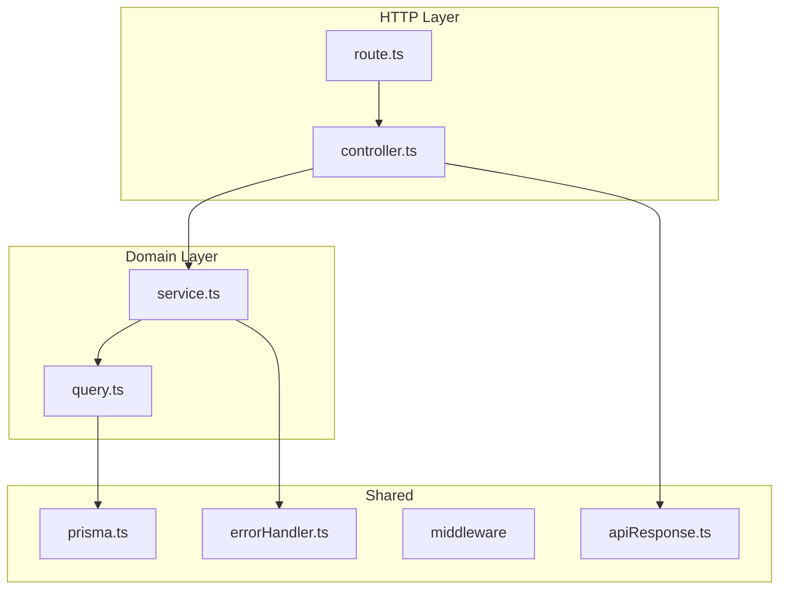

# Backend Refactoring Guide

This document is the source of truth for refactoring the DoDesk backend from its current ad-hoc structure into a layered, resource-based architecture.

---

## Goals

- **Discoverable routes** — no side-effect imports; every endpoint visible in a route file
- **Thin controllers** — HTTP concerns only; no Prisma, no business logic
- **Testable layers** — services and queries can be unit-tested in isolation
- **Consistent API responses** — one envelope for success and error across all endpoints
- **Global error handling** — throw `AppError` in services; never return `{ status: 404 }` from controllers

---

## Current Problems

### 1. Side-effect route registration

Routes are registered at the bottom of controller files when the module is imported:

```typescript
// backend/src/controllers/issueController.ts
createApi().post("/team/:team_id/issues").authSecure(createIssue);
createApi().get("/workspace/:workspace_id/issues").authSecure(getIssues);
// ...
```

And `backend/src/routes.ts` wires them via side-effect imports:

```typescript
import './controllers/issueController';
import './controllers/workspaceController';
// ...
```

There is no single place to see the full route map.

### 2. Fat controllers

Controller files mix HTTP handling, validation, business rules, Prisma queries, and error handling. For example, `backend/src/controllers/issueController.ts` is ~400 lines with inline database access in every handler.

### 3. Custom router abstraction

`backend/src/utils/router.ts` defines a `createApi().get(...).authSecure(...)` DSL that wraps Express. This limits middleware composition — `roleMiddleware.ts` exists but is barely used because it doesn't fit the DSL.

### 4. Inconsistent API responses

| Source | Response shape |
|--------|----------------|
| Issue create | `{ status, message, issue }` |
| Issue delete | `{ status, message, data: { issue } }` |
| Workspaces list | `{ status, message, workspaces }` |
| Auth middleware | `{ error: "Unauthorized" }` |
| Role middleware | `{ message: "Admin access required" }` |
| Intended helpers (`utils/response.ts`) | `{ status, data, message, type }` |

The client works around this inconsistently — e.g. `workspaceStore.ts` reads `res.data.workspaces` in one place and `res.data.data?.members` in another.

### 5. Duplicate error handling

Controllers use try/catch and return error objects. The router's `execute()` method also catches and returns a generic 500. Two competing patterns, neither complete.

---

## Target Architecture

### Request flow



### Folder layout

```
backend/src/
├── app.ts                          # Express app setup, middleware, mount routes
├── server.ts                       # listen()
│
├── resources/
│   ├── issues/
│   │   ├── issue.route.ts          # Express Router + middleware chain
│   │   ├── issue.controller.ts     # Thin HTTP handlers
│   │   ├── issue.service.ts        # Business logic, throws AppError
│   │   ├── issue.query.ts          # Prisma reads/writes only
│   │   ├── issue.schema.ts         # Zod input validation
│   │   └── issue.types.ts          # DTOs, mappers (formatIssue)
│   │
│   ├── workspaces/
│   ├── teams/
│   ├── comments/
│   ├── filters/
│   └── users/
│
├── shared/
│   ├── db/
│   │   └── prisma.ts               # moved from lib/prisma.ts
│   ├── auth/
│   │   └── auth.ts                 # better-auth config (keep as-is)
│   ├── errors/
│   │   ├── AppError.ts
│   │   ├── errorCodes.ts
│   │   └── errorHandler.ts
│   ├── middleware/
│   │   ├── auth.middleware.ts
│   │   ├── asyncHandler.ts
│   │   ├── validate.middleware.ts
│   │   └── workspaceAccess.middleware.ts
│   ├── responses/
│   │   └── apiResponse.ts
│   └── utils/
│       ├── email.ts
│       └── slug.ts
│
└── routes/
    └── index.ts                    # mounts all resource routers at /api
```

### Layer responsibilities

| Layer | File | Does | Does NOT |
|-------|------|------|----------|
| Route | `*.route.ts` | Mount paths, apply middleware (`requireAuth`, `validate`) | Business logic, Prisma |
| Controller | `*.controller.ts` | Extract req params/body, call service, call `sendSuccess` | try/catch, Prisma, validation rules |
| Service | `*.service.ts` | Business rules, access checks, orchestration | Touch `req`/`res`, import Express |
| Query | `*.query.ts` | Prisma queries with shared `include` shapes | Business rules, throw HTTP errors |
| Schema | `*.schema.ts` | Zod schemas for request validation | — |
| Types | `*.types.ts` | DTOs, response types, mappers like `formatIssue()` | — |

---

## API Response Contract

Every endpoint uses the same envelope.

### Success

```json
{
  "success": true,
  "data": {
    "issue": { "id": "issue_123", "title": "Fix login redirect" }
  },
  "message": "Issue created successfully"
}
```

- `message` is optional on success
- All resource payloads live inside `data`

### Error

```json
{
  "success": false,
  "error": {
    "code": "TEAM_NOT_FOUND",
    "message": "Team not found"
  }
}
```

Validation errors include `details`:

```json
{
  "success": false,
  "error": {
    "code": "VALIDATION_ERROR",
    "message": "Invalid request body",
    "details": [
      { "field": "title", "message": "Title is required" }
    ]
  }
}
```

### Shared helpers

```typescript
// shared/errors/AppError.ts
export class AppError extends Error {
  constructor(
    public code: string,
    public statusCode: number,
    message?: string,
    public details?: unknown,
  ) {
    super(message ?? code);
  }
}

// shared/responses/apiResponse.ts
export const sendSuccess = <T>(res: Response, data: T, status = 200, message?: string) =>
  res.status(status).json({ success: true, data, ...(message && { message }) });

export const sendError = (res: Response, error: AppError) =>
  res.status(error.statusCode).json({
    success: false,
    error: {
      code: error.code,
      message: error.message,
      ...(error.details ? { details: error.details } : {}),
    },
  });

// shared/middleware/asyncHandler.ts
export const asyncHandler = (fn: RequestHandler): RequestHandler =>
  (req, res, next) => Promise.resolve(fn(req, res, next)).catch(next);

// shared/errors/errorHandler.ts — mounted last in app.ts
export const errorHandler: ErrorRequestHandler = (err, _req, res, _next) => {
  if (err instanceof AppError) return sendError(res, err);

  if (err instanceof ZodError) {
    return sendError(res, new AppError('VALIDATION_ERROR', 400, 'Invalid request body', err.errors));
  }

  console.error(err);
  return sendError(res, new AppError('INTERNAL_ERROR', 500, 'Internal server error'));
};
```

Auth middleware must also use this shape:

```typescript
// Before
return res.status(401).json({ error: 'Unauthorized' });

// After
return res.status(401).json({
  success: false,
  error: { code: 'UNAUTHORIZED', message: 'Unauthorized' },
});
```

---

## Vertical Slice Example: Issues

The `issues` resource is the pilot template. All other resources follow the same pattern.

### Current endpoints (migration source)

From `backend/src/controllers/issueController.ts`:

| Method | Current path |
|--------|-------------|
| POST | `/api/team/:team_id/issues` |
| GET | `/api/workspace/:workspace_id/issues` |
| GET | `/api/team/:team_id/issues` |
| GET | `/api/issues/:issueId` |
| PUT | `/api/issues/:issueId` |
| DELETE | `/api/issues/:issueId` |

### Target endpoints

| Method | Target path |
|--------|------------|
| POST | `/api/teams/:teamId/issues` |
| GET | `/api/workspaces/:workspaceId/issues` |
| GET | `/api/teams/:teamId/issues` |
| GET | `/api/issues/:issueId` |
| PUT | `/api/issues/:issueId` |
| DELETE | `/api/issues/:issueId` |

---

### HTTP examples

#### Create issue — `POST /api/teams/:teamId/issues`

**Request**

```http
POST /api/teams/team_abc123/issues
Content-Type: application/json

{
  "title": "Fix login redirect",
  "description": "Users land on /signin after OAuth",
  "state": "todo",
  "priority": 2,
  "assigneeId": "user_xyz"
}
```

**Response `201`**

```json
{
  "success": true,
  "message": "Issue created successfully",
  "data": {
    "issue": {
      "id": "issue_123",
      "title": "Fix login redirect",
      "description": "Users land on /signin after OAuth",
      "state": "todo",
      "priority": 2,
      "number": 42,
      "issueKey": "ENG-42",
      "dueDate": null,
      "labels": [],
      "workspaceId": "ws_456",
      "teamId": "team_abc123",
      "assigneeId": "user_xyz",
      "creatorId": "user_me",
      "createdAt": "2026-06-13T10:00:00.000Z",
      "updatedAt": "2026-06-13T10:00:00.000Z",
      "creator": { "id": "user_me", "name": "Shilendra", "email": "me@example.com" },
      "assignee": { "id": "user_xyz", "name": "Alex", "email": "alex@example.com" },
      "team": { "key": "ENG", "name": "Engineering" }
    }
  }
}
```

#### Get issue — `GET /api/issues/:issueId`

**Response `200`**

```json
{
  "success": true,
  "data": {
    "issue": {
      "id": "issue_123",
      "issueKey": "ENG-42",
      "commentCount": 3
    }
  }
}
```

#### Error — team not found

**Response `404`**

```json
{
  "success": false,
  "error": {
    "code": "TEAM_NOT_FOUND",
    "message": "Team not found"
  }
}
```

---

### File examples

#### `issue.route.ts`

```typescript
import { Router } from 'express';
import { requireAuth } from '@/shared/middleware/auth.middleware';
import { validate } from '@/shared/middleware/validate.middleware';
import { createIssue, getIssueById, getIssuesByWorkspace, getIssuesByTeam, updateIssue, deleteIssue } from './issue.controller';
import { createIssueSchema, updateIssueSchema } from './issue.schema';

const router = Router();

router.post('/teams/:teamId/issues', requireAuth, validate(createIssueSchema), createIssue);
router.get('/workspaces/:workspaceId/issues', requireAuth, getIssuesByWorkspace);
router.get('/teams/:teamId/issues', requireAuth, getIssuesByTeam);
router.get('/issues/:issueId', requireAuth, getIssueById);
router.put('/issues/:issueId', requireAuth, validate(updateIssueSchema), updateIssue);
router.delete('/issues/:issueId', requireAuth, deleteIssue);

export default router;
```

#### `issue.controller.ts`

```typescript
import { AuthenticatedRequest } from '@/shared/types/express';
import { asyncHandler } from '@/shared/middleware/asyncHandler';
import { sendSuccess } from '@/shared/responses/apiResponse';
import { issueService } from './issue.service';

export const createIssue = asyncHandler(async (req: AuthenticatedRequest, res) => {
  const issue = await issueService.create({
    ...req.body,
    teamId: req.params.teamId,
    creatorId: req.user.id,
  });
  sendSuccess(res, { issue }, 201, 'Issue created successfully');
});

export const getIssueById = asyncHandler(async (req: AuthenticatedRequest, res) => {
  const issue = await issueService.getById(req.params.issueId, req.user.id);
  sendSuccess(res, { issue });
});
```

#### `issue.service.ts`

```typescript
import { AppError } from '@/shared/errors/AppError';
import { issueQuery } from './issue.query';
import { teamQuery } from '@/resources/teams/team.query';
import { formatIssue } from './issue.types';

export const issueService = {
  async create(input: CreateIssueInput) {
    const team = await teamQuery.findById(input.teamId);
    if (!team) throw new AppError('TEAM_NOT_FOUND', 404);

    const number = await issueQuery.getNextNumber(input.teamId);

    const issue = await issueQuery.create({
      title: input.title,
      description: input.description ?? null,
      state: input.state ?? 'backlog',
      priority: input.priority ?? 0,
      labels: input.labels ?? [],
      dueDate: input.dueDate ? new Date(input.dueDate) : null,
      workspaceId: team.workspaceId,
      teamId: input.teamId,
      assigneeId: input.assigneeId ?? null,
      creatorId: input.creatorId,
      number,
    });

    return formatIssue(issue);
  },

  async getById(issueId: string, userId: string) {
    const issue = await issueQuery.findById(issueId);
    if (!issue) throw new AppError('ISSUE_NOT_FOUND', 404);

    await issueService.assertUserCanAccessWorkspace(userId, issue.workspaceId);

    return formatIssue(issue);
  },
};
```

#### `issue.query.ts`

```typescript
import prisma from '@/shared/db/prisma';

const issueIncludes = {
  creator: { select: { id: true, name: true, email: true } },
  assignee: { select: { id: true, name: true, email: true } },
  team: { select: { key: true, name: true, color: true } },
  _count: { select: { comments: true } },
} as const;

export const issueQuery = {
  findById: (id: string) =>
    prisma.issue.findUnique({ where: { id }, include: issueIncludes }),

  findByWorkspace: (workspaceId: string, filters: ListIssuesQuery) =>
    prisma.issue.findMany({
      where: {
        workspaceId,
        ...(filters.state && { state: filters.state }),
        ...(filters.assignee && { assigneeId: filters.assignee }),
      },
      include: issueIncludes,
      orderBy: [{ priority: 'asc' }, { createdAt: 'desc' }],
    }),

  getNextNumber: async (teamId: string) => {
    const last = await prisma.issue.findFirst({
      where: { teamId },
      orderBy: { number: 'desc' },
      select: { number: true },
    });
    return (last?.number ?? 0) + 1;
  },

  create: (data: Prisma.IssueCreateInput) =>
    prisma.issue.create({ data, include: issueIncludes }),
};
```

### Before vs after (same handler)

**Before** — mixed concerns, manual error returns:

```typescript
const createIssue: ControllerFunction = async (req) => {
  try {
    const team = await prisma.team.findUnique({ where: { id: teamId } });
    if (!team) return { status: 404, message: 'Team not found' };
    const createdIssue = await prisma.issue.create({ ... });
    return { status: 201, message: '...', issue: { ...createdIssue, issueKey: '...' } };
  } catch (error) {
    return { status: 500, message: 'Failed to create issue' };
  }
};
createApi().post('/team/:team_id/issues').authSecure(createIssue);
```

**After** — ~8 lines, no try/catch, no Prisma:

```typescript
export const createIssue = asyncHandler(async (req, res) => {
  const issue = await issueService.create({
    ...req.body,
    teamId: req.params.teamId,
    creatorId: req.user.id,
  });
  sendSuccess(res, { issue }, 201, 'Issue created successfully');
});
```

---

## Route Naming Conventions

Apply during each resource migration. Do not rename everything in one PR.

| Current | Target |
|---------|--------|
| `POST /workspace` | `POST /workspaces` |
| `GET /workspaces` | `GET /workspaces` (keep) |
| `/workspace/:workspace_id/teams` | `/workspaces/:workspaceId/teams` |
| `/team/:team_id/issues` | `/teams/:teamId/issues` |
| `POST /user/set-last-active-workspace` | `PATCH /users/me/active-workspace` |
| `GET /auth/me` | `GET /users/me` |
| `GET /user` | `GET /users/me` |

Rules:
- Plural resource nouns (`/workspaces`, `/teams`, `/issues`)
- camelCase route params (`workspaceId`, not `workspace_id`)
- Nest resources logically (`/workspaces/:workspaceId/teams`)

---

## Migration Phases

Migrate one resource per PR. Keep the app running after each phase.

### Phase 0 — Shared foundation

**Add:**
- `shared/errors/AppError.ts`, `errorHandler.ts`, `errorCodes.ts`
- `shared/responses/apiResponse.ts`
- `shared/middleware/asyncHandler.ts`, `validate.middleware.ts`
- `routes/index.ts` — mounts all resource routers
- Split `index.ts` into `app.ts` + `server.ts`

**Do not delete yet:** `utils/router.ts`, existing controllers

### Phase 1 — Issues (pilot template)

**Add:** `resources/issues/*` (full vertical slice)

**Delete:** `controllers/issueController.ts`

**Update client:** `client/services/issueService.ts`

### Phase 2 — Workspaces + teams

These are coupled (workspace creation creates a default team). Migrate together.

**Add:** `resources/workspaces/*`, `resources/teams/*`, `shared/utils/slug.ts`

**Delete:** `controllers/workspaceController.ts`, `controllers/teamController.ts`

**Update client:** `client/stores/workspaceStore.ts`, `client/stores/teamStore.ts`, `client/hooks/useWorkspaceOperations.ts`

### Phase 3 — Comments, filters, users

**Add:** `resources/comments/*`, `resources/filters/*`, `resources/users/*`

**Delete:** `controllers/commentController.ts`, `controllers/savedFilterController.ts`, `controllers/userController.ts`, `routes/me.ts`

**Update client:** `client/services/commentService.ts`, `client/services/savedFilterService.ts`

### Phase 4 — Cleanup

**Delete:**
- `utils/router.ts` and `createApi()`
- `routes.ts` (side-effect imports)
- `types/controllers/*` (types moved into resource folders)
- `utils/response.ts` (replaced by `shared/responses/apiResponse.ts`)
- Dead code (e.g. unused `createUser` in `userController.ts` — auth is handled by better-auth)

### Per-phase checklist

- [ ] Extract query layer — all Prisma out of controller
- [ ] Extract service layer — business rules, access checks
- [ ] Thin controller + dedicated route file
- [ ] Zod schemas for write endpoints
- [ ] Normalize responses to `{ success, data }` envelope
- [ ] Update client services if response path changed
- [ ] Smoke test all endpoints manually
- [ ] Delete old controller file

---

## What Stays Unchanged

| Item | Reason |
|------|--------|
| `backend/src/lib/auth.ts` | better-auth mounted separately at `/api/auth/*` |
| `backend/prisma/schema.prisma` | No schema changes needed for this refactor |
| Frontend structure | Only update `client/services/*` when response envelope changes |

---

## Client Impact

### Response path change

```typescript
// Before
const issue = response.data.issue;

// After (with envelope)
const issue = response.data.data.issue;
```

### Recommended unwrap helper

Add to `client/lib/api.ts`:

```typescript
interface ApiSuccess<T> {
  success: true;
  data: T;
  message?: string;
}

interface ApiError {
  success: false;
  error: { code: string; message: string; details?: unknown };
}

export type ApiResponse<T> = ApiSuccess<T> | ApiError;

export const unwrap = <T>(response: AxiosResponse<ApiSuccess<T>>): T =>
  response.data.data;
```

Usage:

```typescript
// client/services/issueService.ts
createIssue: async (issueData: CreateIssueData): Promise<Issue> => {
  const response = await api.post(`/api/teams/${issueData.teamId}/issues`, issueData);
  return unwrap<{ issue: Issue }>(response).issue;
},
```

### Files to update per phase

| Phase | Client files |
|-------|-------------|
| 1 — Issues | `client/services/issueService.ts` |
| 2 — Workspaces/teams | `client/stores/workspaceStore.ts`, `client/stores/teamStore.ts`, `client/hooks/useWorkspaceOperations.ts`, `client/components/features/onboarding/*`, `client/components/features/teams/CreateTeamDialog.tsx` |
| 3 — Comments/filters/users | `client/services/commentService.ts`, `client/services/savedFilterService.ts`, auth callback pages |

Note: `commentService.ts` already reads `response.data.data.*` in some places while `issueService.ts` reads `response.data.*` directly — the refactor is an opportunity to unify this.

---

## Definition of Done (per resource)

A resource migration is complete when:

- [ ] No `prisma` import outside `*.query.ts`
- [ ] No `try/catch` in controllers or services — throw `AppError` instead
- [ ] No route registration outside `*.route.ts`
- [ ] All success responses use `sendSuccess`
- [ ] All errors flow through global `errorHandler`
- [ ] Input validation via Zod schemas on write endpoints
- [ ] Types colocated in the resource folder, not `types/controllers/`
- [ ] Old controller file deleted
- [ ] Client services updated and smoke-tested

---

## Resources to Migrate

| Resource | Current file | Endpoints | Phase |
|----------|-------------|-----------|-------|
| Issues | `controllers/issueController.ts` | 6 | 1 |
| Workspaces | `controllers/workspaceController.ts` | 8 | 2 |
| Teams | `controllers/teamController.ts` | 3 | 2 |
| Comments | `controllers/commentController.ts` | 4 | 3 |
| Filters | `controllers/savedFilterController.ts` | 4 | 3 |
| Users | `controllers/userController.ts`, `routes/me.ts` | 2 | 3 |

**Total:** 27 endpoints across 6 resources (+ better-auth routes which stay separate).
